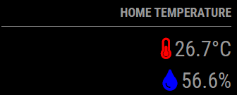
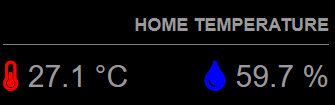
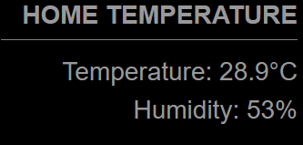
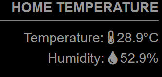

# MMM-DHT22 Module for MagicMirror²

| Status  | Version | Date       | Maintained? |MagicMirror² Version |
| ------- | ------- | ---------- | ----------- |-------------------- |
| Working | 1.0.3   | 10.09.2023 | Yes         | 2.24.0              |

The **MMM-DHT22** module displays temperature and humidity data from a DHT22 sensor on your MagicMirror².

## Examples






## Installation

1. Navigate to your MagicMirror's `modules` directory using the terminal:
  ```shell
  cd ~/MagicMirror/modules
  ```
2. Clone this repository:

  ```shell
  git clone https://github.com/J0n4e/MMM-DHT22
  ```

3. Install required dependencies:

  ```shell
  cd MMM-DHT22
  npm install
  ```

4. Install Adafruit DHT Library:

  ```shell
  cd ~
  sudo apt-get update
  sudo apt-get install python3-dev python3-pip
  git clone https://github.com/adafruit/Adafruit_Python_DHT.git
  cd Adafruit_Python_DHT
  sudo python3 setup.py install
  ```

5. Test the Library (Optional):

  ```shell
  cd examples
  python3 AdafruitDHT.py 22 <GPIO_PIN>
  ```

## Configuration

To use this module, add it to the modules array in the config/config.js file of your MagicMirror installation:

```javascript
modules: [
  {
    module: 'MMM-DHT22',
    position: 'top_right',
    config: {
      // Configuration options here
    }
  }
]
```

### Configuration Options

* `gpioPin`: GPIO pin number for the DHT22 sensor.
* `fontSize`: Font size for the header.
* `fontFamily`: Font family for module text.
* `showThermometerIcon`: Set to true to show the thermometer icon.
* `showDropletIcon`: Set to true to show the droplet icon.
* `showTemperatureText`: Set to true to show the temperature text.
* `showHumidityText`: Set to true to show the humidity text.
* `headerText`: The header text to be displayed above the values.
* `updateInterval`: Update interval in seconds for fetching sensor data.
* `temperatureIconColor`: set the color for the temperature icon
* `humidityIconColor`: set the color for the humidity icon
* `temperatureFontSize`: set the size for the temperature icon
* `humidityFontSize`: set the size for the humidity icon
* `temperatureOffset`: calibrate the temperature reading
* `humidityOffset`: calibrate the humidity reading
* `temperatureUnit`: channge the units Celsius of Fahrenheit
* `layout`: Default layout style ('horizontal' or 'vertical')

### Example Configuration

Here's an example configuration for the MMM-DHT22 module:

```javascript
modules: [
  {
    module: 'MMM-DHT22',
    position: 'top_right',
    config: {
    gpioPin: 6, // GPIO pin number where the DHT22 sensor is connected
    fontSize: '16px', // Font size for the header
    fontFamily: 'Arial', // Font family for module text
    showThermometerIcon: true, // Show the thermometer icon
    showDropletIcon: true, // Show the droplet icon
    showTemperatureText: true, // Show the "Temperature" text
    showHumidityText: true, // Show the "Humidity" text
    headerText: 'Local Environment', // Header text displayed above the values
    updateInterval: 120, // Update interval in seconds for fetching sensor data
    temperatureIconColor: 'red', // Color of the temperature icon
    humidityIconColor: 'blue', // Color of the humidity icon
    temperatureFontSize: '18px', // Font size for temperature
    humidityFontSize: '14px', // Font size for humidity
    temperatureOffset: 0, // Temperature offset adjustment in degrees Celsius
    humidityOffset: 0,    // Humidity offset adjustment in percentage points
    temperatureUnit: 'F', // Default to Celsius ('C') or use 'F' for Fahrenheit
    layout: 'horizontal', // Default layout style ('horizontal' or 'vertical')
    }
  }
]
```

## Version info

* v1.0.0
  * Initial release
* v1.0.1
  * Added option to modify the color of the temperature and humidity icons
  * Added option to modify the header size
* v1.0.2
  * Fix the error readings from sensor
  * Added option to calibrate the sensor readings
  * Added option to change units: C or F
* v1.0.3
  * added default layout style ('horizontal' or 'vertical')

## License

This project is licensed under the MIT License. See the LICENSE file for details.

Support and Contributions:

If you encounter any issues or have suggestions for improvements, please open an issue on the GitHub repository.

## Acknowledgments

Special thanks to the MagicMirror² community and contributors.
